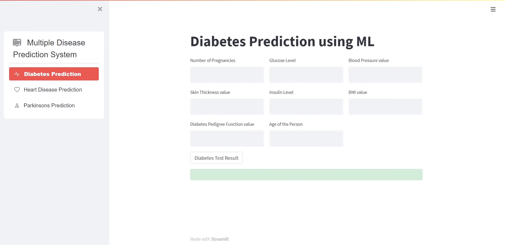
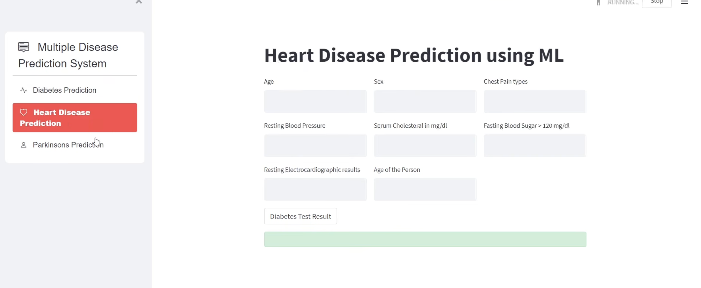
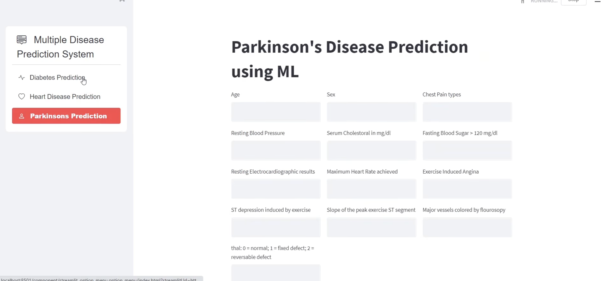

# 🩺 Healthcare-Disease-Prediction-ML

Machine Learning based healthcare web application for predicting Diabetes, Heart Disease, and Parkinson’s Disease using Python and Streamlit with an interactive, responsive, and user-friendly interface for real-time disease prediction, medical data analysis, and healthcare assistance.
---

# 🚀 Features

- Multiple Disease Prediction System
- Diabetes Disease Prediction
- Heart Disease Prediction
- Parkinson’s Disease Prediction
- Interactive Streamlit Web Application
- Fast & Accurate Predictions
- User-Friendly Interface
- Real-Time Prediction Results
- Machine Learning Integrated System

---

# 🛠️ Technologies Used

- Python
- Streamlit
- Scikit-learn
- Pandas
- NumPy
- Pickle

---

# 📂 Project Structure

```bash
Healthcare-Disease-Prediction-ML/
│
├── app.py
├── requirements.txt
├── README.md
│
├── dataset/
├── saved_models/
├── screenshots/
└── colab_files_to_train_models/
```

---

# 📸 Project Screenshots

## Diabetes Prediction



---

## Heart Disease Prediction



---

## Parkinson’s Disease Prediction



---

# ⚙️ Installation

## Clone the repository

```bash
git clone https://github.com/your-username/Healthcare-Disease-Prediction-ML.git
```

---

## Install dependencies

```bash
pip install -r requirements.txt
```

---

## Run the application

```bash
streamlit run app.py
```

---

# 🎯 Future Improvements

- Add More Disease Prediction Models
- Improve UI/UX Design
- Add Cloud Database Integration
- Deploy on Streamlit Cloud
- Add User Authentication System

---

# 👨‍💻 Author

Shubham Kumar

---

# ⭐ Support

If you like this project, give it a ⭐ on GitHub.
